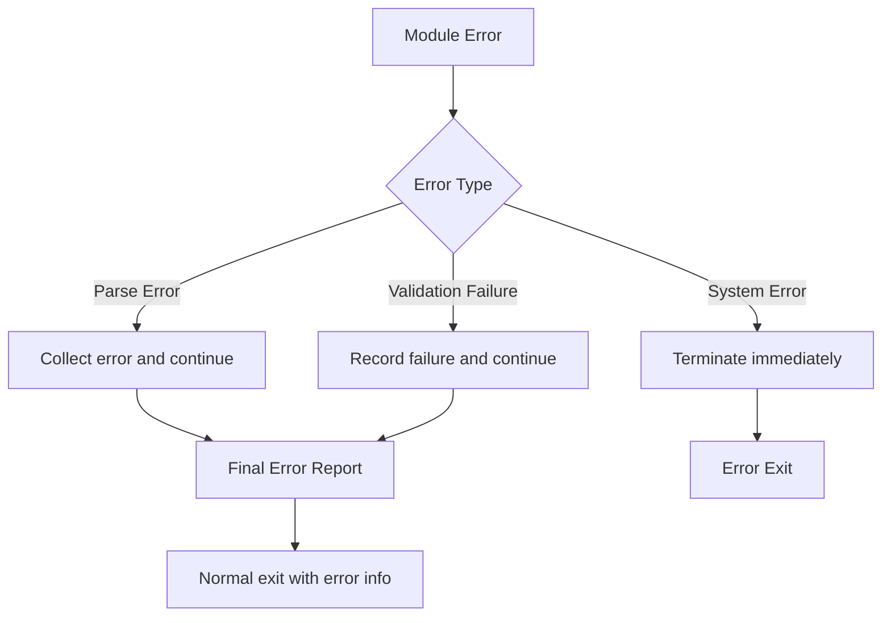

# FlowSpec CLI Architecture Document

This document details the technical architecture, design decisions, and implementation details of the FlowSpec CLI.

## Table of Contents

- [Architecture Overview](#architecture-overview)
- [Module Design](#module-design)
- [Data Flow](#data-flow)
- [Design Decisions](#design-decisions)
- [Performance Optimization](#performance-optimization)
- [Scalability](#scalability)

## Architecture Overview

The FlowSpec CLI uses a modular, layered architecture, following the Single Responsibility Principle and the Dependency Inversion Principle.

```
┌─────────────────────────────────────────────────────────────────┐
│                        CLI Entry Layer                          │
│  • Command-line argument parsing                                │
│  • Flow orchestration                                            │
│  • Error handling and user feedback                              │
└─────────────────────────────────────────────────────────────────┘
                                    │
                                    ▼
┌─────────────────┐    ┌─────────────────┐    ┌─────────────────┐
│   SpecParser    │    │ TraceIngestor   │    │AlignmentEngine  │
│                 │    │                 │    │                 │
│ • Multi-language │    │ • OTel Parsing  │    │ • JSONLogic     │
│ • Annotation Ext.│    │ • Trace Org.    │    │ • Assertion Eval.│
│ • Fault Tolerance│    │ • Memory Opt.   │    │ • Report Gen.   │
└─────────────────┘    └─────────────────┘    └─────────────────┘
                                    │
                                    ▼
                        ┌─────────────────┐
                        │ ReportRenderer  │
                        │                 │
                        │ • Human Format  │
                        │ • JSON Format   │
                        │ • Exit Code Mgmt│
                        └─────────────────┘
```

### Core Design Principles

1.  **Modularity**: Each module has a clear boundary of responsibility.
2.  **Testability**: Dependency injection is achieved through interface abstraction.
3.  **Scalability**: Supports plug-in extensions for new language parsers and output formats.
4.  **Performance Optimization**: Stream processing, concurrency safety, memory control.
5.  **Fault Tolerance**: Graceful error handling and recovery mechanisms.

## Module Design

### 1. CLI Entry Layer (cmd/flowspec-cli)

#### Responsibilities
- Parsing and validating command-line arguments.
- Orchestrating module calls according to the FlowSpec specification.
- Global error handling and user feedback.
- Log configuration and output management.

#### Key Components

```go
type CLI struct {
    specParser      SpecParser
    traceIngestor   TraceIngestor
    alignmentEngine AlignmentEngine
    reportRenderer  ReportRenderer
    logger          *logrus.Logger
    config          *CLIConfig
}

type CLIConfig struct {
    SourcePath   string
    TracePath    string
    OutputFormat string
    Verbose      bool
    LogLevel     string
}
```

#### Flow Orchestration

The CLI strictly follows the flow defined in `phase1_mvp.flowspec.yaml`:

1.  **Parameter Validation Phase**: Validates the input parameters.
2.  **Parsing Phase**: Calls the SpecParser to parse the source code.
3.  **Ingestion Phase**: Calls the TraceIngestor to process trace data.
4.  **Alignment Phase**: Calls the AlignmentEngine to perform validation.
5.  **Rendering Phase**: Calls the ReportRenderer to generate the report.

### 2. SpecParser Module (internal/parser)

#### Architectural Design

```go
// Main parser
type SpecParser struct {
    fileParsers []FileParser
    logger      *logrus.Logger
}

// File parser interface
type FileParser interface {
    CanParse(filename string) bool
    ParseFile(filepath string) ([]ServiceSpec, []ParseError)
}

// Concrete implementations
type JavaParser struct { /* ... */ }
type TypeScriptParser struct { /* ... */ }
type GoParser struct { /* ... */ }
```

#### Multi-language Support Strategy

**Plugin-based Design**: Each language has an independent parser implementation, managed uniformly through the `FileParser` interface.

**Fault Tolerance**:
- Failure to parse a single file does not affect the overall process.
- All errors are collected and reported together at the end.
- Detailed error context (file path, line number, reason) is provided.

**Performance Optimization**:
- Parallel file scanning and parsing.
- Smart file filtering (pre-filtering based on extension).
- Caching mechanism for parsing results.

#### Unified Annotation Format

ServiceSpec annotations for all languages follow the same structure:

```yaml
operationId: "string"
description: "string"
preconditions: JSONLogic_Object
postconditions: JSONLogic_Object
```

### 3. TraceIngestor Module (internal/ingestor)

#### Architectural Design

```go
type TraceIngestor struct {
    parser      *OTLPParser
    indexer     *SpanIndexer
    memMonitor  *MemoryMonitor
}

type TraceStore struct {
    traces    map[string]*TraceData
    spanIndex map[string][]*Span  // operationId -> spans
    nameIndex map[string][]*Span  // spanName -> spans
}
```

#### Memory Optimization Strategy

**Stream Parsing**:
- Uses `json.Decoder` for streaming JSON parsing.
- Avoids loading the entire file into memory at once.
- Processes large files in chunks, releasing memory promptly.

**Index Optimization**:
- Builds multi-dimensional indexes to speed up queries.
- Uses a memory pool to reuse objects.
- Implements an LRU cache mechanism.

**Memory Monitoring**:
- Monitors memory usage in real-time.
- Sets a memory usage limit (default 500MB).
- Provides graceful degradation under memory pressure.

#### Data Organization

```go
type TraceData struct {
    TraceID   string
    RootSpan  *Span
    Spans     map[string]*Span
    SpanTree  *SpanNode
}

type SpanNode struct {
    Span     *Span
    Children []*SpanNode
}
```

**Tree Structure Construction**:
- Builds a span tree based on `parentSpanId`.
- Supports a forest structure with multiple root nodes.
- Provides depth-first and breadth-first traversal.

### 4. AlignmentEngine Module (internal/engine)

#### Architectural Design

```go
type AlignmentEngine struct {
    evaluator   AssertionEvaluator
    contextBuilder ContextBuilder
    reporter    ResultReporter
}

type JSONLogicEvaluator struct {
    engine *jsonlogic.Engine
    sandbox *ExpressionSandbox
}
```

#### JSONLogic Integration

**Expression Sandbox**:
- Limits expression execution time.
- Prevents infinite loops and recursion.
- Restricts memory usage.

**Context Construction**:
```go
type EvaluationContext struct {
    Span struct {
        Attributes map[string]interface{}
        StartTime  time.Time
        Name       string
    }
    EndTime time.Time    // Available only in postconditions
    Status  SpanStatus   // Available only in postconditions
    Events  []SpanEvent  // Available only in postconditions
}
```

#### Validation Flow

1.  **Spec Matching**: Matches ServiceSpec and Span based on `operationId`.
2.  **Precondition Evaluation**: Uses the context at the start of the span.
3.  **Postcondition Evaluation**: Uses the full context at the completion of the span.
4.  **Result Aggregation**: Collects all validation details to generate the final report.

### 5. ReportRenderer Module (internal/renderer)

#### Architectural Design

```go
type ReportRenderer struct {
    humanRenderer *HumanRenderer
    jsonRenderer  *JSONRenderer
    exitCodeManager *ExitCodeManager
}

type HumanRenderer struct {
    colorizer *ColorOutput
    formatter *TextFormatter
}
```

#### Output Formats

**Human Format**:
- Colorized terminal output.
- Hierarchical information display.
- Progress indication and statistical summary.

**JSON Format**:
- Structured data output.
- Easy for programmatic processing.
- Complies with JSON Schema specification.

#### Exit Code Management

```go
const (
    ExitSuccess      = 0  // Validation successful
    ExitValidationFailed = 1  // Validation failed
    ExitSystemError  = 2  // System error
)
```

## Data Flow

### Complete Data Flow

```mermaid
graph TD
    A[CLI Arguments] --> B[Parameter Validation]
    B --> C[SpecParser]
    C --> D[ServiceSpec[]]
    
    E[Trace File] --> F[TraceIngestor]
    F --> G[TraceStore]
    
    D --> H[AlignmentEngine]
    G --> H
    H --> I[AlignmentReport]
    
    I --> J[ReportRenderer]
    J --> K[Terminal Output]
    J --> L[Exit Code]
```

### Error Propagation



## Design Decisions

### 1. Why choose the Go language?

- **Performance**: Compiled language, high execution efficiency.
- **Concurrency**: Native goroutine support, suitable for parallel processing.
- **Deployment**: Single binary file, simple deployment.
- **Ecosystem**: Rich libraries for CLI and JSON processing.

### 2. Why use JSONLogic?

- **Expressiveness**: Supports complex logical expressions.
- **Security**: Sandboxed execution, prevents code injection.
- **Readability**: JSON format, easy to understand and debug.
- **Extensibility**: Supports custom operators.

### 3. Why use interface abstraction?

- **Testability**: Facilitates mocking and unit testing.
- **Extensibility**: Supports plugin-based extensions.
- **Decoupling**: Reduces dependencies between modules.
- **Maintainability**: Facilitates independent development and maintenance.

### 4. Why choose stream processing?

- **Memory Efficiency**: Avoids loading large files into memory at once.
- **Real-time Capability**: Supports real-time data processing.
- **Scalability**: Supports larger-scale data processing.

## Performance Optimization

### 1. Parsing Performance Optimization

**Parallel Processing**:
```go
func (p *SpecParser) parseFiles(files []string) {
    semaphore := make(chan struct{}, runtime.NumCPU())
    var wg sync.WaitGroup
    
    for _, file := range files {
        wg.Add(1)
        go func(f string) {
            defer wg.Done()
            semaphore <- struct{}{}
            defer func() { <-semaphore }()
            
            p.parseFile(f)
        }(file)
    }
    
    wg.Wait()
}
```

**Smart Caching**:
- File modification time check.
- Caching of parsing results.
- Incremental update mechanism.

### 2. Memory Optimization

**Object Pool**:
```go
var spanPool = sync.Pool{
    New: func() interface{} {
        return &Span{}
    },
}

func getSpan() *Span {
    return spanPool.Get().(*Span)
}

func putSpan(s *Span) {
    s.Reset()
    spanPool.Put(s)
}
```

**Memory Monitoring**:
```go
type MemoryMonitor struct {
    maxMemory uint64
    current   uint64
    mu        sync.RWMutex
}

func (m *MemoryMonitor) CheckMemoryLimit() error {
    m.mu.RLock()
    defer m.mu.RUnlock()
    
    if m.current > m.maxMemory {
        return ErrMemoryLimitExceeded
    }
    return nil
}
```

### 3. Query Optimization

**Multi-dimensional Indexing**:
```go
type SpanIndexer struct {
    byOperationId map[string][]*Span
    byName        map[string][]*Span
    byTimeRange   *TimeRangeIndex
}
```

**Query Caching**:
- LRU caching for hot queries.
- Pre-computation of query results.
- Index pre-warming mechanism.

## Scalability

### 1. New Language Support

To add a new language parser, simply implement the `FileParser` interface:

```go
type PythonParser struct{}

func (p *PythonParser) CanParse(filename string) bool {
    return strings.HasSuffix(filename, ".py")
}

func (p *PythonParser) ParseFile(filepath string) ([]ServiceSpec, []ParseError) {
    // Python-specific parsing logic
    return specs, errors
}

// Register the parser
specParser.RegisterFileParser(&PythonParser{})
```

### 2. New Output Format

To add a new output format, extend the `ReportRenderer`:

```go
func (r *ReportRenderer) RenderXML(report *AlignmentReport) (string, error) {
    // XML rendering logic
    return xmlOutput, nil
}
```

### 3. Custom Assertion Operators

Extend the JSONLogic engine:

```go
func init() {
    jsonlogic.AddOperator("custom_op", func(data interface{}, params ...interface{}) interface{} {
        // Custom operator logic
        return result
    })
}
```

### 4. Plugin System

In the future, a plugin system based on Go's `plugin` package could be considered:

```go
type Plugin interface {
    Name() string
    Version() string
    Initialize() error
    Shutdown() error
}

type ParserPlugin interface {
    Plugin
    GetFileParser() FileParser
}
```

## Security Considerations

### 1. Input Validation

- File path traversal protection.
- JSON parsing depth limit.
- File size limit.

### 2. Expression Sandbox

- Execution time limit.
- Memory usage limit.
- Prohibition of dangerous operations.

### 3. Error Message Security

- Sanitization of sensitive path information.
- Cleaning of stack traces.
- Standardization of error messages.

## Monitoring and Observability

### 1. Performance Metrics

- Parsing time statistics.
- Memory usage monitoring.
- Query performance analysis.

### 2. Error Tracking

- Structured log output.
- Error classification statistics.
- Exception stack collection.

### 3. Runtime Metrics

- Number of files processed.
- Validation success rate.
- Resource usage.

---

This architectural design provides a solid technical foundation for the FlowSpec CLI, ensuring the system's maintainability, scalability, and high performance. As the project evolves, the architecture will continue to be refined to meet new requirements.
