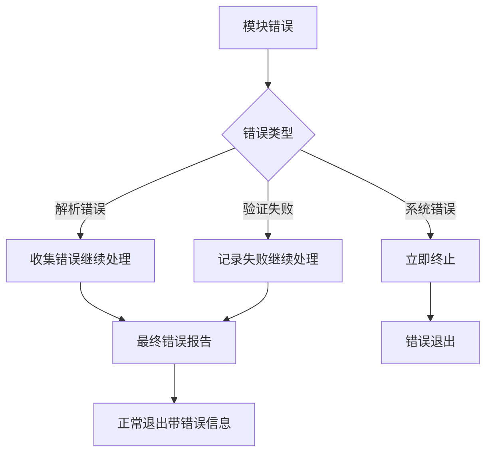

# FlowSpec CLI 架构文档

本文档详细描述了 FlowSpec CLI 的技术架构、设计决策和实现细节。

## 目录

- [架构概览](#架构概览)
- [模块设计](#模块设计)
- [数据流](#数据流)
- [设计决策](#设计决策)
- [性能优化](#性能优化)
- [扩展性](#扩展性)

## 架构概览

FlowSpec CLI 采用模块化的分层架构，遵循单一职责原则和依赖倒置原则。

```
┌─────────────────────────────────────────────────────────────────┐
│                        CLI 入口层                                │
│  • 命令行参数解析                                                │
│  • 流程编排                                                      │
│  • 错误处理和用户反馈                                            │
└─────────────────────────────────────────────────────────────────┘
                                    │
                                    ▼
┌─────────────────┐    ┌─────────────────┐    ┌─────────────────┐
│   SpecParser    │    │ TraceIngestor   │    │AlignmentEngine  │
│                 │    │                 │    │                 │
│ • 多语言解析     │    │ • OTel 解析     │    │ • JSONLogic     │
│ • 注解提取       │    │ • 轨迹组织       │    │ • 断言评估       │
│ • 容错处理       │    │ • 内存优化       │    │ • 报告生成       │
└─────────────────┘    └─────────────────┘    └─────────────────┘
                                    │
                                    ▼
                        ┌─────────────────┐
                        │ ReportRenderer  │
                        │                 │
                        │ • Human 格式    │
                        │ • JSON 格式     │
                        │ • 退出码管理     │
                        └─────────────────┘
```

### 核心设计原则

1. **模块化**: 每个模块都有明确的职责边界
2. **可测试性**: 通过接口抽象实现依赖注入
3. **可扩展性**: 支持新语言解析器和输出格式的插件化扩展
4. **性能优化**: 流式处理、并发安全、内存控制
5. **容错性**: 优雅的错误处理和恢复机制

## 模块设计

### 1. CLI 入口层 (cmd/flowspec-cli)

#### 职责
- 命令行参数解析和验证
- 按照 FlowSpec 规约编排各模块调用
- 全局错误处理和用户反馈
- 日志配置和输出管理

#### 关键组件

```go
type CLI struct {
    specParser      SpecParser
    traceIngestor   TraceIngestor
    alignmentEngine AlignmentEngine
    reportRenderer  ReportRenderer
    logger          *logrus.Logger
    config          *CLIConfig
}

type CLIConfig struct {
    SourcePath   string
    TracePath    string
    OutputFormat string
    Verbose      bool
    LogLevel     string
}
```

#### 流程编排

CLI 严格按照 `phase1_mvp.flowspec.yaml` 中定义的流程执行：

1. **参数验证阶段**: 验证输入参数的有效性
2. **解析阶段**: 调用 SpecParser 解析源代码
3. **摄取阶段**: 调用 TraceIngestor 处理轨迹数据
4. **对齐阶段**: 调用 AlignmentEngine 执行验证
5. **渲染阶段**: 调用 ReportRenderer 生成报告

### 2. SpecParser 模块 (internal/parser)

#### 架构设计

```go
// 主解析器
type SpecParser struct {
    fileParsers []FileParser
    logger      *logrus.Logger
}

// 文件解析器接口
type FileParser interface {
    CanParse(filename string) bool
    ParseFile(filepath string) ([]ServiceSpec, []ParseError)
}

// 具体实现
type JavaParser struct { /* ... */ }
type TypeScriptParser struct { /* ... */ }
type GoParser struct { /* ... */ }
```

#### 多语言支持策略

**插件化设计**: 每种语言都有独立的解析器实现，通过 `FileParser` 接口统一管理。

**容错处理**: 
- 单个文件解析失败不影响整体流程
- 收集所有错误信息，最后统一报告
- 提供详细的错误上下文（文件路径、行号、错误原因）

**性能优化**:
- 并行文件扫描和解析
- 智能文件过滤（根据扩展名预筛选）
- 解析结果缓存机制

#### 注解格式统一

所有语言的 ServiceSpec 注解都遵循相同的结构：

```yaml
operationId: "string"
description: "string"
preconditions: JSONLogic_Object
postconditions: JSONLogic_Object
```

### 3. TraceIngestor 模块 (internal/ingestor)

#### 架构设计

```go
type TraceIngestor struct {
    parser      *OTLPParser
    indexer     *SpanIndexer
    memMonitor  *MemoryMonitor
}

type TraceStore struct {
    traces    map[string]*TraceData
    spanIndex map[string][]*Span  // operationId -> spans
    nameIndex map[string][]*Span  // spanName -> spans
}
```

#### 内存优化策略

**流式解析**:
- 使用 `json.Decoder` 进行流式 JSON 解析
- 避免一次性加载整个文件到内存
- 分块处理大文件，及时释放内存

**索引优化**:
- 构建多维度索引加速查询
- 使用内存池复用对象
- 实现 LRU 缓存机制

**内存监控**:
- 实时监控内存使用情况
- 设置内存使用上限（默认 500MB）
- 提供内存压力下的优雅降级

#### 数据组织

```go
type TraceData struct {
    TraceID   string
    RootSpan  *Span
    Spans     map[string]*Span
    SpanTree  *SpanNode
}

type SpanNode struct {
    Span     *Span
    Children []*SpanNode
}
```

**树形结构构建**:
- 根据 `parentSpanId` 构建 Span 树
- 支持多根节点的森林结构
- 提供深度优先和广度优先遍历

### 4. AlignmentEngine 模块 (internal/engine)

#### 架构设计

```go
type AlignmentEngine struct {
    evaluator   AssertionEvaluator
    contextBuilder ContextBuilder
    reporter    ResultReporter
}

type JSONLogicEvaluator struct {
    engine *jsonlogic.Engine
    sandbox *ExpressionSandbox
}
```

#### JSONLogic 集成

**表达式沙盒**:
- 限制表达式执行时间
- 防止无限循环和递归
- 内存使用限制

**上下文构建**:
```go
type EvaluationContext struct {
    Span struct {
        Attributes map[string]interface{}
        StartTime  time.Time
        Name       string
    }
    EndTime time.Time    // 仅在后置条件中可用
    Status  SpanStatus   // 仅在后置条件中可用
    Events  []SpanEvent  // 仅在后置条件中可用
}
```

#### 验证流程

1. **Spec 匹配**: 根据 `operationId` 匹配 ServiceSpec 和 Span
2. **前置条件评估**: 使用 Span 开始时的上下文
3. **后置条件评估**: 使用 Span 完成时的完整上下文
4. **结果聚合**: 收集所有验证详情，生成最终报告

### 5. ReportRenderer 模块 (internal/renderer)

#### 架构设计

```go
type ReportRenderer struct {
    humanRenderer *HumanRenderer
    jsonRenderer  *JSONRenderer
    exitCodeManager *ExitCodeManager
}

type HumanRenderer struct {
    colorizer *ColorOutput
    formatter *TextFormatter
}
```

#### 输出格式

**Human 格式**:
- 彩色终端输出
- 层次化信息展示
- 进度指示和统计汇总

**JSON 格式**:
- 结构化数据输出
- 便于程序化处理
- 符合 JSON Schema 规范

#### 退出码管理

```go
const (
    ExitSuccess      = 0  // 验证成功
    ExitValidationFailed = 1  // 验证失败
    ExitSystemError  = 2  // 系统错误
)
```

## 数据流

### 完整数据流程

```mermaid
graph TD
    A[CLI 参数] --> B[参数验证]
    B --> C[SpecParser]
    C --> D[ServiceSpec[]]
    
    E[轨迹文件] --> F[TraceIngestor]
    F --> G[TraceStore]
    
    D --> H[AlignmentEngine]
    G --> H
    H --> I[AlignmentReport]
    
    I --> J[ReportRenderer]
    J --> K[终端输出]
    J --> L[退出码]
```

### 错误传播



## 设计决策

### 1. 为什么选择 Go 语言？

- **性能**: 编译型语言，执行效率高
- **并发**: 原生 goroutine 支持，适合并行处理
- **部署**: 单一二进制文件，部署简单
- **生态**: 丰富的 CLI 和 JSON 处理库

### 2. 为什么使用 JSONLogic？

- **表达能力**: 支持复杂的逻辑表达式
- **安全性**: 沙盒执行，避免代码注入
- **可读性**: JSON 格式，易于理解和调试
- **扩展性**: 支持自定义操作符

### 3. 为什么采用接口抽象？

- **可测试性**: 便于 Mock 和单元测试
- **可扩展性**: 支持插件化扩展
- **解耦**: 降低模块间的依赖关系
- **维护性**: 便于独立开发和维护

### 4. 为什么选择流式处理？

- **内存效率**: 避免大文件一次性加载
- **实时性**: 支持实时数据处理
- **可扩展性**: 支持更大规模的数据处理

## 性能优化

### 1. 解析性能优化

**并行处理**:
```go
func (p *SpecParser) parseFiles(files []string) {
    semaphore := make(chan struct{}, runtime.NumCPU())
    var wg sync.WaitGroup
    
    for _, file := range files {
        wg.Add(1)
        go func(f string) {
            defer wg.Done()
            semaphore <- struct{}{}
            defer func() { <-semaphore }()
            
            p.parseFile(f)
        }(file)
    }
    
    wg.Wait()
}
```

**智能缓存**:
- 文件修改时间检查
- 解析结果缓存
- 增量更新机制

### 2. 内存优化

**对象池**:
```go
var spanPool = sync.Pool{
    New: func() interface{} {
        return &Span{}
    },
}

func getSpan() *Span {
    return spanPool.Get().(*Span)
}

func putSpan(s *Span) {
    s.Reset()
    spanPool.Put(s)
}
```

**内存监控**:
```go
type MemoryMonitor struct {
    maxMemory uint64
    current   uint64
    mu        sync.RWMutex
}

func (m *MemoryMonitor) CheckMemoryLimit() error {
    m.mu.RLock()
    defer m.mu.RUnlock()
    
    if m.current > m.maxMemory {
        return ErrMemoryLimitExceeded
    }
    return nil
}
```

### 3. 查询优化

**多维索引**:
```go
type SpanIndexer struct {
    byOperationId map[string][]*Span
    byName        map[string][]*Span
    byTimeRange   *TimeRangeIndex
}
```

**查询缓存**:
- LRU 缓存热点查询
- 查询结果预计算
- 索引预热机制

## 扩展性

### 1. 新语言支持

添加新语言解析器只需实现 `FileParser` 接口：

```go
type PythonParser struct{}

func (p *PythonParser) CanParse(filename string) bool {
    return strings.HasSuffix(filename, ".py")
}

func (p *PythonParser) ParseFile(filepath string) ([]ServiceSpec, []ParseError) {
    // Python 特定的解析逻辑
    return specs, errors
}

// 注册解析器
specParser.RegisterFileParser(&PythonParser{})
```

### 2. 新输出格式

添加新输出格式只需扩展 `ReportRenderer`：

```go
func (r *ReportRenderer) RenderXML(report *AlignmentReport) (string, error) {
    // XML 格式渲染逻辑
    return xmlOutput, nil
}
```

### 3. 自定义断言操作符

扩展 JSONLogic 引擎：

```go
func init() {
    jsonlogic.AddOperator("custom_op", func(data interface{}, params ...interface{}) interface{} {
        // 自定义操作符逻辑
        return result
    })
}
```

### 4. 插件系统

未来可以考虑实现基于 Go plugin 的插件系统：

```go
type Plugin interface {
    Name() string
    Version() string
    Initialize() error
    Shutdown() error
}

type ParserPlugin interface {
    Plugin
    GetFileParser() FileParser
}
```

## 安全考虑

### 1. 输入验证

- 文件路径遍历防护
- JSON 解析深度限制
- 文件大小限制

### 2. 表达式沙盒

- 执行时间限制
- 内存使用限制
- 禁止危险操作

### 3. 错误信息安全

- 敏感路径信息脱敏
- 堆栈跟踪清理
- 错误信息标准化

## 监控和可观测性

### 1. 性能指标

- 解析耗时统计
- 内存使用监控
- 查询性能分析

### 2. 错误追踪

- 结构化日志输出
- 错误分类统计
- 异常堆栈收集

### 3. 运行时指标

- 处理文件数量
- 验证成功率
- 资源使用情况

---

这个架构设计为 FlowSpec CLI 提供了坚实的技术基础，确保系统的可维护性、可扩展性和高性能。随着项目的发展，架构会持续演进以满足新的需求。
